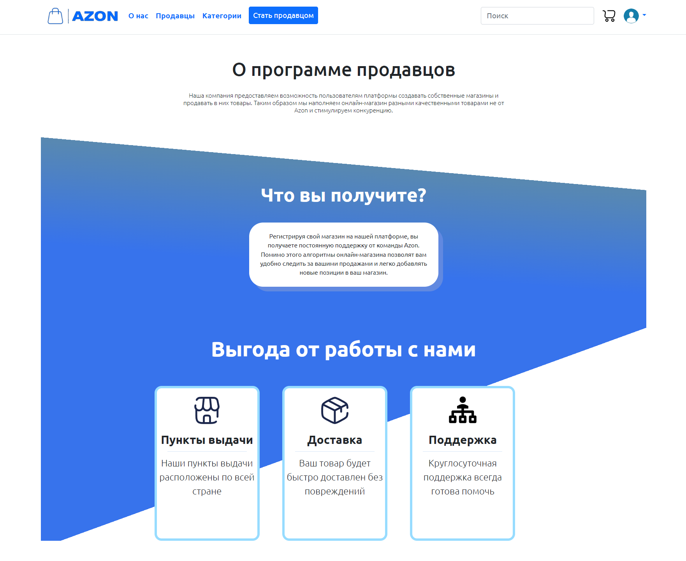

# Azon


Welcome to **Azon**, an online store web application designed to offer users a seamless and secure shopping experience. Whether you're buying or selling products, Azon provides an intuitive platform that caters to all your needs. Built using the Flask framework, Azon leverages a range of modern technologies to deliver a robust and scalable e-commerce solution.

<br>



## Features

- **User-Friendly Interface**: A clean and intuitive design that makes online shopping a breeze.
- **Secure Transactions**: Enhanced security with JWT authentication to protect user data.
- **Product Management**: Easy creation, updating, and deletion of products and shops.
- **Shop Management**: Manage multiple shops with detailed information and images.
- **Geocoding**: Integration with Yandex Maps API for finding places.
- **API Access**: Extensive API to interact with the platform programmatically.

## Used technologies
* Python 3.9;
* Flask (Web application framework);
* PostgreSQL (database);
* SQLAlchemy (working with database from Python);
* HTML, CSS, JS;
* Bootstrap (CSS and JS framework);
* Jinja2 (Templating engine);
* [Yandex Maps API](https://yandex.ru/maps-api/) (finding places);
* Flask-RESTful (Creating Azon API);

## Getting Started

### Prerequisites

To run Azon on your local machine, you'll need:

- **Python 3.9+**
- **PostgreSQL**
- **Git**

### Installation

Follow these steps to set up Azon on your local machine:

1. **Clone the repository**:

    ```bash
    git clone https://github.com/yourusername/azon.git
    cd azon
    ```

2. **Create and activate a virtual environment**:

    ```bash
    python -m venv venv
    source venv/bin/activate   # On Windows, use `venv\Scripts\activate`
    ```

3. **Install dependencies**:

    ```bash
    pip install -r requirements.txt
    ```

4. **Configure the environment variables**:

    - Create a `.env` file in the root directory and add your secret keys:


5. **Initialize the database**:

    ```bash
    flask db init
    flask db migrate
    flask db upgrade
    flask category_load  # Load initial categories
    ```

6. **Run the application**:

    ```bash
    flask run
    ```

    Alternatively, you can run the `start.sh` script:

    ```bash
    ./start.sh
    ```

    The application will be accessible at `http://127.0.0.1:5000`.

<hr>


## Azon API Documentation

Azon provides a RESTful API for accessing and managing shops, items, and user authentication. Below is the detailed documentation of available endpoints.

### Authentication

Azon uses JSON Web Tokens (JWT) for authentication. Include the following in your `.env` file:

- `JWT_SECRET_KEY`: The secret key for encoding JWT tokens.
- `JWT_TOKEN_LOCATION`: Set to `['headers']` to specify where the JWT token is located.
- `JWT_HEADER_NAME`: The name of the header containing the JWT token, typically set as `Authorization`.
- `JWT_HEADER_TYPE`: The type of the JWT token, specified as `Bearer`.
- `JWT_ACCESS_TOKEN_EXPIRES`: Set the expiry duration of the access token to 7 days.

### User Authentication Endpoints

#### User Login

- **Endpoint**: `/api/1.0/login`
- **Method**: `POST`
- **Description**: Authenticates a user and returns a JWT token.
- **Request Body**:

  ```json
  {
    "email": "string",
    "password": "string"
  }
  ```

- **Response**: A JSON object containing the access token.

### Shop Endpoints

#### Retrieve Shop Logo

- **Endpoint**: `/api/1.0/shop/<string:shop_name>/logo`
- **Method**: `GET`
- **Description**: Retrieves the logo image of a specified shop.
- **Response**: Returns the image in `image/jpeg` format or a JSON message if the image is not found.

#### Get Shop Details

- **Endpoint**: `/api/1.0/shop/<string:shop_name>`
- **Method**: `GET`
- **Description**: Retrieves details of a specified shop and its items.
- **Authentication**: JWT required.
- **Response**: JSON object containing shop details including name, about, contact, logo URL, and items.

#### Create Shop

- **Endpoint**: `/api/1.0/shop`
- **Method**: `POST`
- **Description**: Creates a new shop.
- **Authentication**: JWT required.
- **Request Body**:

  ```json
  {
    "name": "string",
    "about": "string",
    "contact": "string"
  }
  ```

- **Response**: JSON message indicating successful creation.

#### Update Shop

- **Endpoint**: `/api/1.0/shop/<string:shop_name>`
- **Method**: `PUT`
- **Description**: Updates details of a specified shop.
- **Authentication**: JWT required.
- **Request Body**:

  ```json
  {
    "name": "string",
    "about": "string",
    "contact": "string"
  }
  ```

- **Response**: JSON message indicating successful update.

#### Delete Shop

- **Endpoint**: `/api/1.0/shop/<string:shop_name>`
- **Method**: `DELETE`
- **Description**: Deletes a specified shop.
- **Authentication**: JWT required.
- **Response**: JSON message indicating successful deletion.

### Item Endpoints

#### Retrieve Item Logo

- **Endpoint**: `/api/1.0/item/<int:article>/logo`
- **Method**: `GET`
- **Description**: Retrieves the logo image of a specified item.
- **Response**: Returns the image in `image/jpeg` format or a JSON message if the image is not found.

#### Get Item Details

- **Endpoint**: `/api/1.0/shop/item/<int:article>`
- **Method**: `GET`
- **Description**: Retrieves details of a specified item.
- **Authentication**: JWT required.
- **Response**: JSON object containing item details including name, price, about, categories, and logo URL.

#### Create Item

- **Endpoint**: `/api/1.0/shop/item`
- **Method**: `POST`
- **Description**: Creates a new item.
- **Authentication**: JWT required.
- **Request Body**:

  ```json
  {
    "name": "string",
    "price": "float",
    "about": "string",
    "shop_name": "string",
    "category1": "string",
    "category2": "string",
    "category3": "string"
  }
  ```

- **Response**: JSON message indicating successful creation.

#### Update Item

- **Endpoint**: `/api/1.0/shop/item/<int:article>`
- **Method**: `PUT`
- **Description**: Updates details of a specified item.
- **Authentication**: JWT required.
- **Request Body**:

  ```json
  {
    "name": "string",
    "price": "float",
    "about": "string",
    "category1": "string",
    "category2": "string",
    "category3": "string"
  }
  ```

- **Response**: JSON message indicating successful update.

#### Delete Item

- **Endpoint**: `/api/1.0/shop/item/<int:article>`
- **Method**: `DELETE`
- **Description**: Deletes a specified item.
- **Authentication**: JWT required.
- **Response**: JSON message indicating successful deletion.

## Contributing

We welcome contributions from the community! If you'd like to contribute, please follow these guidelines:

1. **Fork the repository** on GitHub.
2. **Clone your fork** locally:

   ```bash
   git clone https://github.com/yourusername/azon.git
   ```

3. **Create a new branch** for your feature or bugfix:

   ```bash
   git checkout -b feature-name
   ```

4. **Commit your changes** with clear messages:

   ```bash
   git commit -m "Description of the changes"
   ```

5. **Push your branch** to GitHub:

   ```bash
   git push origin feature-name
   ```

6. **Submit a pull request** to the main repository.

Please ensure that your code follows our [style guidelines](STYLE_GUIDE.md) and includes relevant tests.

## License

Azon is open-source software licensed under the MIT License. See the [LICENSE](LICENSE) file for more details.

## Contact

For any questions or suggestions, please reach out to us at:

- **GitHub**: [Azon Project]([https://github.com/yourusername/azon](https://github.com/PavelFr8/Azon))

